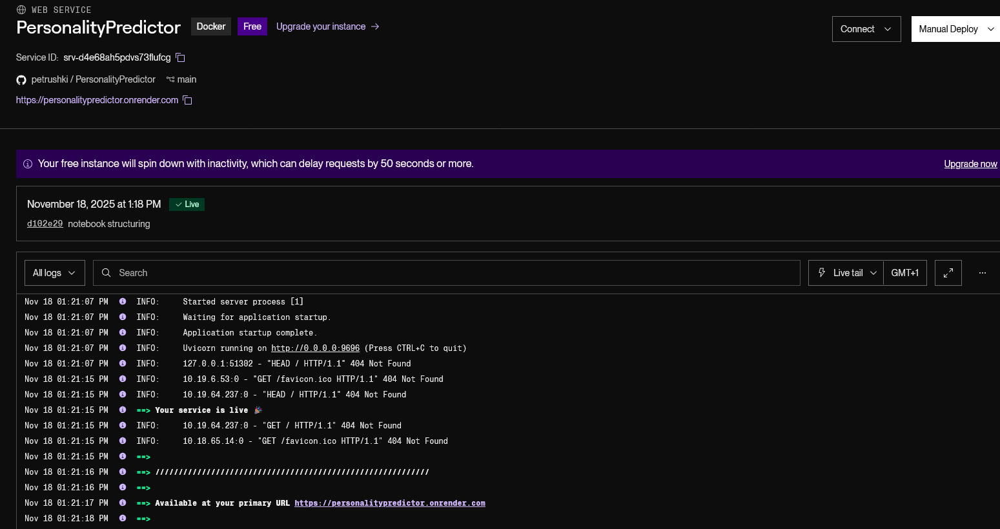
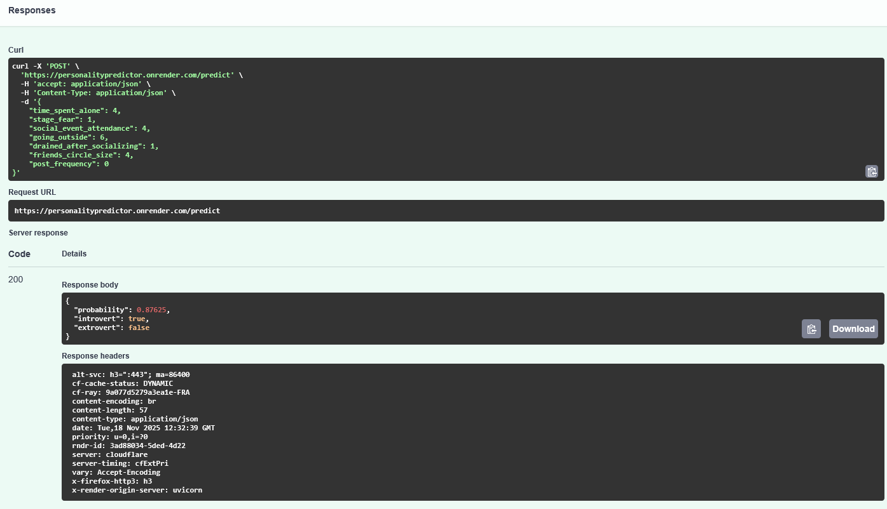

# PersonalityPredictor

## Project Overview

**PersonalityPredictor** is a machine learning project that classifies whether a person is more **introverted (1)** or **extroverted (0)** based on seven behavioral features.
The goal is to build and evaluate several binary classifiers, compare their performance using AUROC, and deploy the final model as an API.

Personality prediction can support:

* **Audience segmentation & marketing**
* **Behavioral modeling**
* **Psychology and social behavior research**
* **Synthetic data experimentation**

---

## Problem Description

Given a set of behavioral attributes, the task is to predict a binary personality label:

* **0 → Extroverted**
* **1 → Introverted**

### **Features Used**

| Feature                     | Type               | Description                             |
| --------------------------- | ------------------ | --------------------------------------- |
| `time_spent_alone`          | numeric (-1 to 12) | Average hours spent alone               |
| `stage_fear`                | boolean            | Fear of performing or speaking publicly |
| `social_event_attendance`   | numeric (-1 to 11) | Frequency of attending social events    |
| `going_outside`             | numeric (-1 to 8)  | Tendency to go outside                  |
| `drained_after_socializing` | boolean            | Whether socializing causes energy drain |
| `friends_circle_size`       | numeric (-1 to 16) | Size of the friend circle               |
| `post_frequency`            | numeric (-1 to 11) | Social media posting frequency          |

### **Target Variable**

`personality`:

* **0 = Extroverted**
* **1 = Introverted**

---

## Dataset

The dataset comes from **Syncora.ai** and contains **5,000 synthetic samples**, mimicking realistic social-behavior patterns without any privacy risk.

**Download link:**
[https://huggingface.co/datasets/syncora/introvert_extrovert_personality_dataset](https://huggingface.co/datasets/syncora/introvert_extrovert_personality_dataset)

It captures behaviors related to:

* Time spent alone
* Social engagement frequency
* Energy levels after social interactions
* Social media patterns

The dataset file used in this project is stored at:

```
data/Personality_Syncora_Synthetic.csv
```

---

## Exploratory Data Analysis (EDA)

EDA is fully performed in **notebook.ipynb** and includes:

* Feature distributions
* Missing values analysis
* Correlations
* Class balance
* Feature importance
* Visualizations
* Cross-validated ROC curves

---

## Model Development

The following models were trained and compared (5-fold cross-validation, AUROC metric):

* Logistic Regression
* Decision Tree
* Random Forest
* XGBoost

Hyperparameter tuning was applied to each model.
**Random Forest** achieved the best AUROC and was selected as the final model.

The final model is saved as:

```
model.bin
```

---

## Project Structure

```
├── data/
│   └── Personality_Syncora_Synthetic.csv
├── notebook.ipynb                     # EDA, preprocessing, model training experiments
├── train.py                           # Script to train and save the final model
├── predict.py                         # FastAPI service for model inference
├── model.bin                          # Trained RandomForest model
├── test.py                            # Sample test script for inference
├── Dockerfile                         # Containerizing the inference API
├── pyproject.toml                     # Dependency definitions
├── uv.lock                            # Locked versions for reproducibility
├── .python-version                    # Python version used
├── ping.py                            # API healthcheck endpoint
└── README.md
```

---


# How to Run the Project

This project can be run **via Docker** (recommended) or **locally with uv**.

---

## Docker Usage (Recommended)

### **1. Build the Docker image**

Make sure Docker Desktop is installed and running.

```bash
docker build -t personality-predictor .
```

### **2. Run the container**

```bash
docker run -p 9696:9696 personality-predictor
```

### **3. Access the API**

Open:

```
http://127.0.0.1:9696/docs
```

This opens the interactive Swagger UI where you can test predictions.

### **4. Example JSON for testing**

```json
{
    "time_spent_alone": 4,
    "stage_fear": 1,
    "social_event_attendance": 4,
    "going_outside": 6,
    "drained_after_socializing": 1,
    "friends_circle_size": 4,
    "post_frequency": 0
}
```

### **5. Optional: Test using curl**

```bash
curl -X POST http://127.0.0.1:9696/predict \
    -H "Content-Type: application/json" \
    -d "{\"time_spent_alone\": 4, \"stage_fear\": 1, \"social_event_attendance\": 4, \"going_outside\": 6, \"drained_after_socializing\": 1, \"friends_circle_size\": 4, \"post_frequency\": 0}"
```

---

## Running Locally (Without Docker)

### **1. Clone the repository**

```bash
git clone https://github.com/petrushki/PersonalityPredictor.git
cd PersonalityPredictor
```

### **2. Install dependencies using `uv`**

```bash
uv sync
```

This installs all dependencies listed in `pyproject.toml` and `uv.lock`.

### **3. (Optional) Retrain the model**

```bash
uv run python train.py
```

This recreates `model.bin` from scratch.

### **4. Start the FastAPI service**

Since `predict.py` already runs Uvicorn:

```bash
uv run python predict.py
```

The API will start at:

```
http://127.0.0.1:9696
```


---

## Cloud Deployment (Render)

This project is deployed as a public web service on **Render** using the provided Dockerfile. The service exposes the `/predict` endpoint for personality prediction.

---

###  Accessing the API

The public URL of the deployed service is:

```
https://personalitypredictor.onrender.com
```

You can open:

```
https://personalitypredictor.onrender.com/docs
```

This opens the **Swagger UI**, where you can interactively test the `/predict` endpoint.

---

###  Testing a Sample Request

#### **Using `curl`**

```bash
curl -X POST https://personalitypredictor.onrender.com/predict \
    -H "Content-Type: application/json" \
    -d '{
        "time_spent_alone": 4,
        "stage_fear": 1,
        "social_event_attendance": 4,
        "going_outside": 6,
        "drained_after_socializing": 1,
        "friends_circle_size": 4,
        "post_frequency": 0
    }'
```

#### **Using Python**

```python
import requests

url = "https://personalitypredictor.onrender.com/predict"
payload = {
    "time_spent_alone": 4,
    "stage_fear": 1,
    "social_event_attendance": 4,
    "going_outside": 6,
    "drained_after_socializing": 1,
    "friends_circle_size": 4,
    "post_frequency": 0
}

response = requests.post(url, json=payload)
print(response.json())
```

Example response:

```json
{
  "probability": 0.76,
  "introvert": true,
  "extrovert": false
}
```

---

### Screenshots


**Render Dashboard**


**API Test**




---
